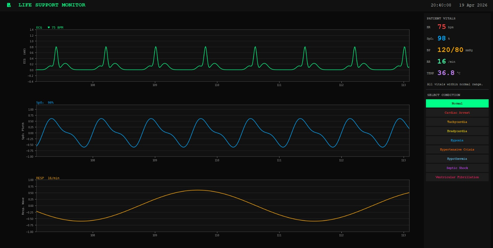
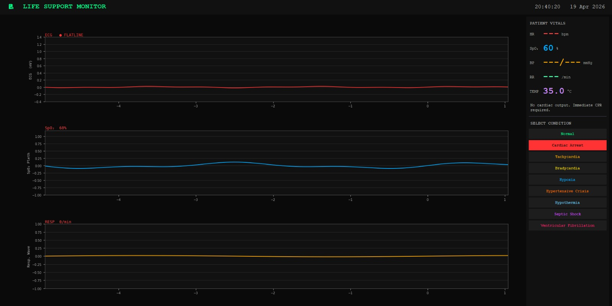
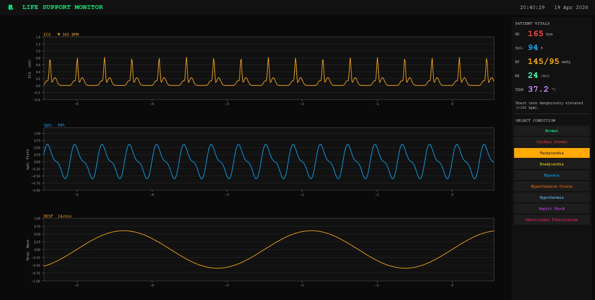
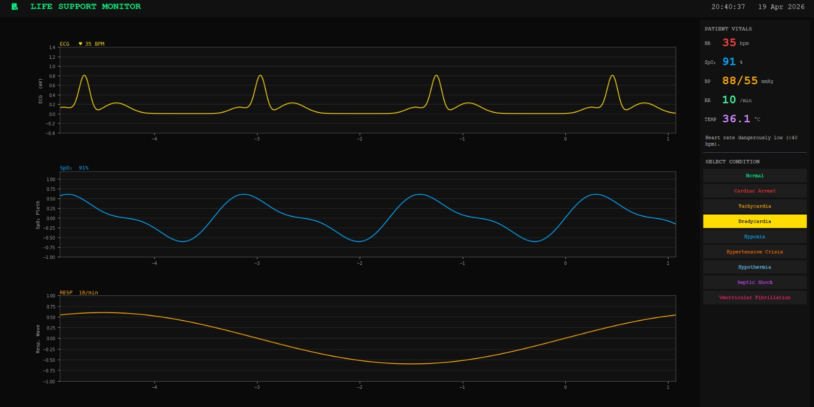
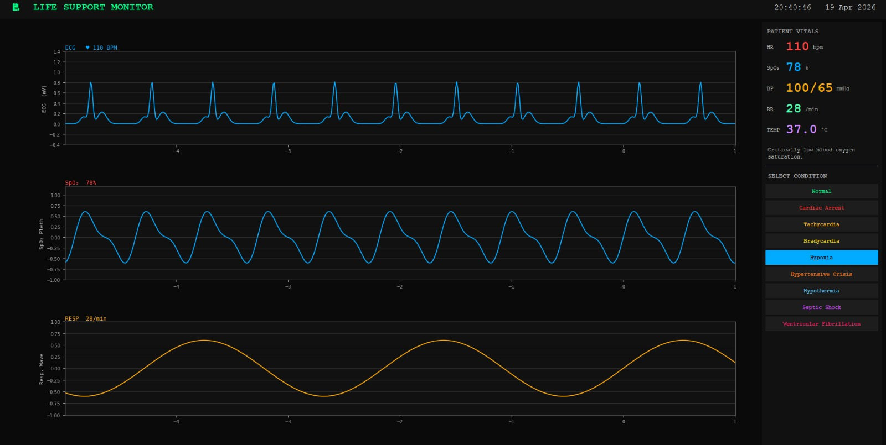
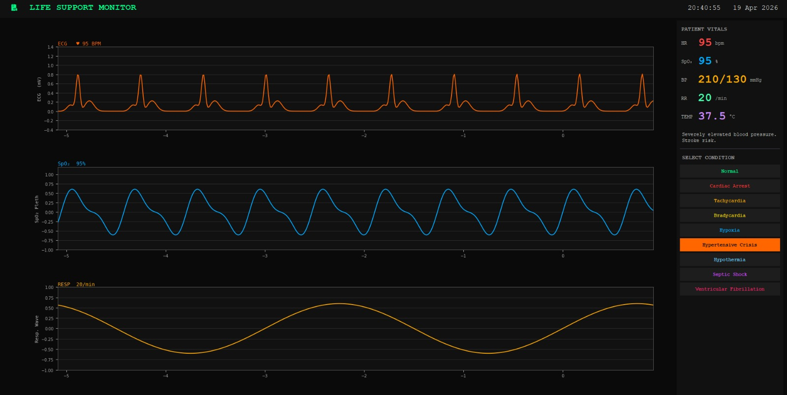
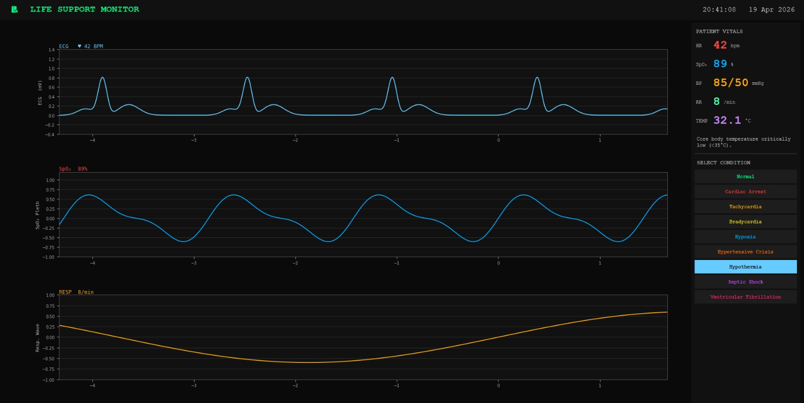
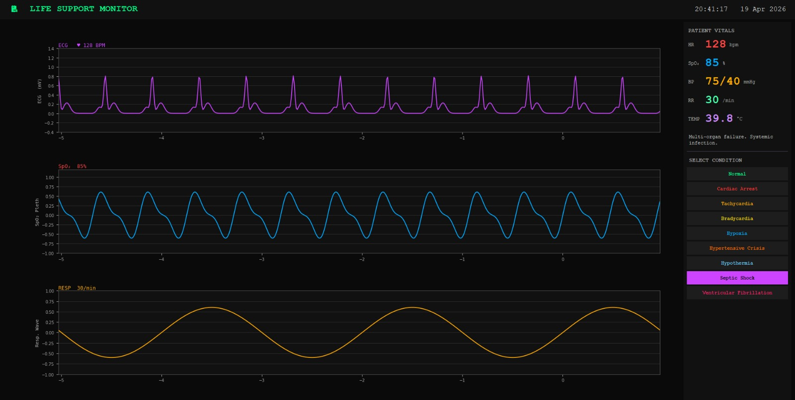
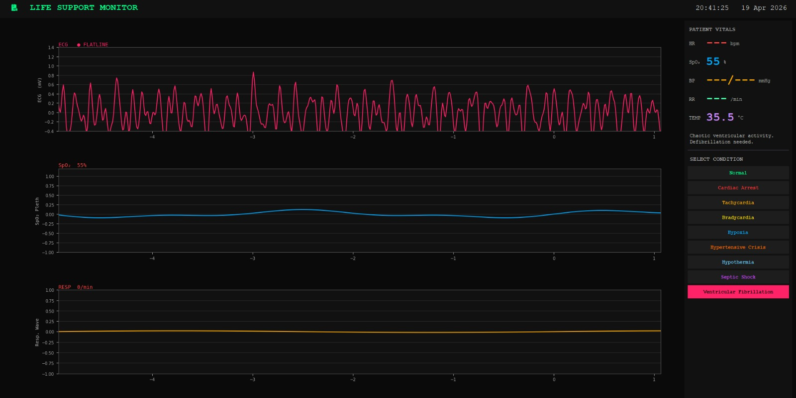

# Life Support Monitor Simulation

A simulation of a life support monitoring system that tracks essential parameters and alerts when values go beyond safe limits.

## Features

### Monitoring & Visualization
- Simulates vital parameters (e.g., heart rate, oxygen level, etc.)
- Real-time status updates
- Graphs generated using sine, exponential, and Gaussian functions

### Alerts & Conditions
- Detects abnormal conditions based on thresholds
- Displays system status clearly
- Predefined condition presets:
  - Normal
  - Cardiac Arrest
  - Tachycardia
  - Bradycardia
  - Hypoxia
  - Hypertensive Crisis
  - Hypothermia
  - Septic Shock
  - Ventricular Fibrillation

### Interface
- Simple and interactive UI
- Clear visual indication of system state

## Tech Stack
- Programming Language: [Your Language Here]
- Framework / Library: [If any]

## Getting Started

### Run the Simulation
1. Clone the repository:
   ```bash
   git clone https://github.com/your-username/life-support-monitor.git
   ```
2. Navigate to the project directory:
   ```bash
   cd life-support-monitor
   ```
3. Run the program:
   ```bash
   [command to run the file]
   ```

## Screenshots
Normal


Cardiac Arrest


Tachycardia


Bradycardia


Hypoxia


Hypertensive Crisis


Hypothermia


Septic Shock


Ventricular Fibrillation



## Purpose
This project was created to simulate a basic monitoring system and to practice concepts like real-time data visualization, mathematical modeling, and system alerts.  
It is intended for learning purposes and future reference.

## License
This project is open for learning and personal use.
